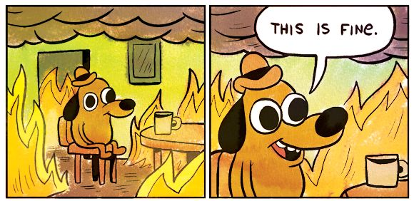
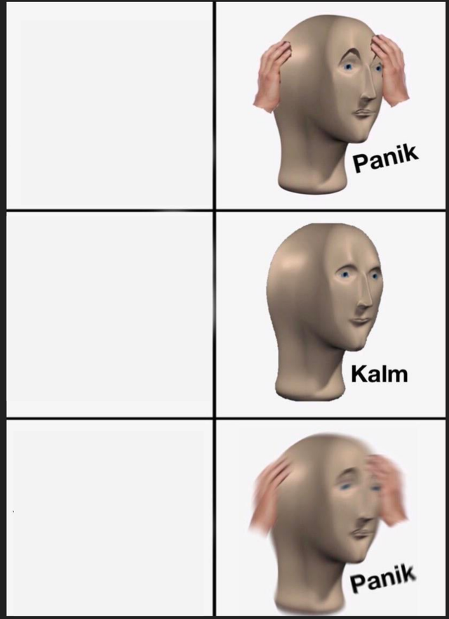
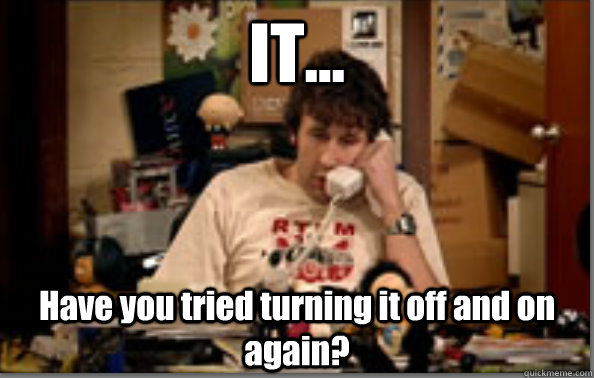
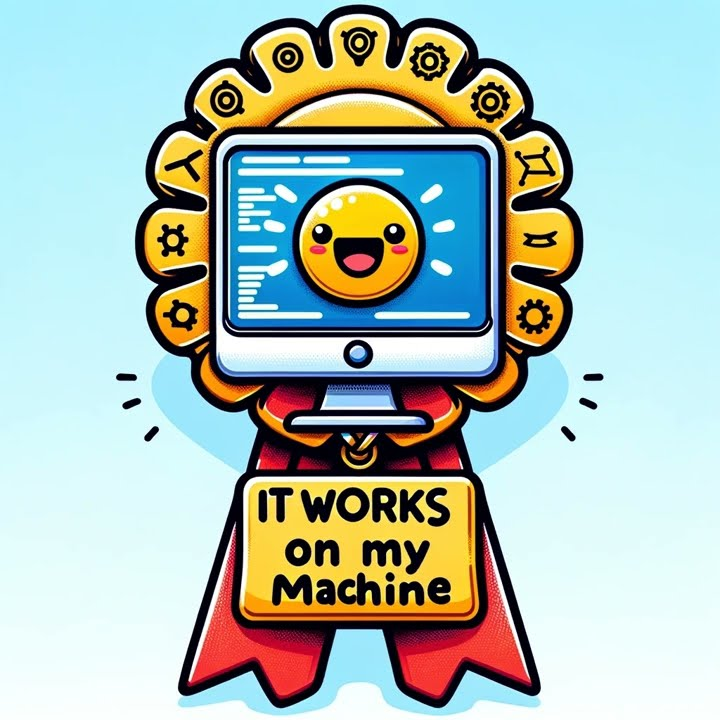
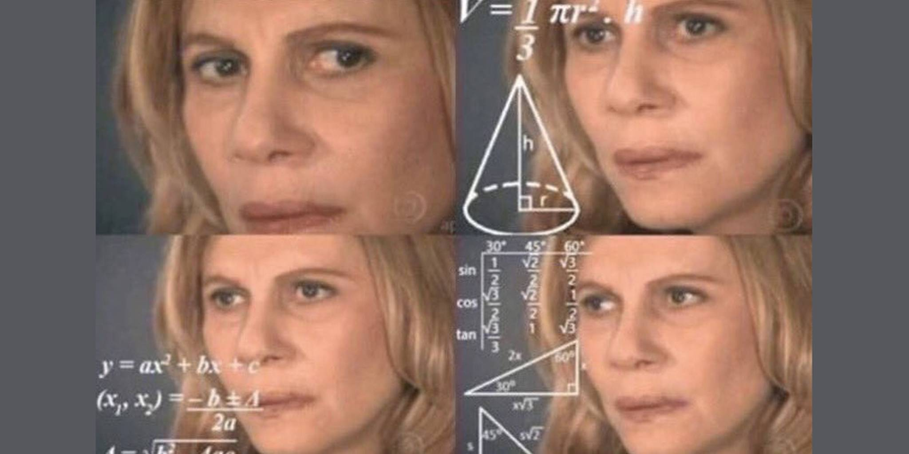
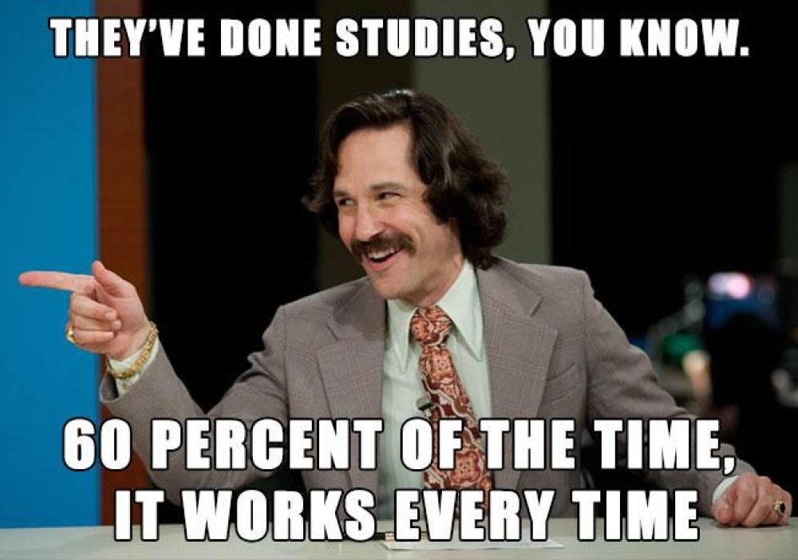
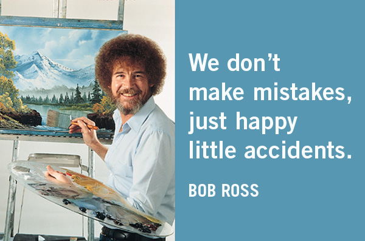
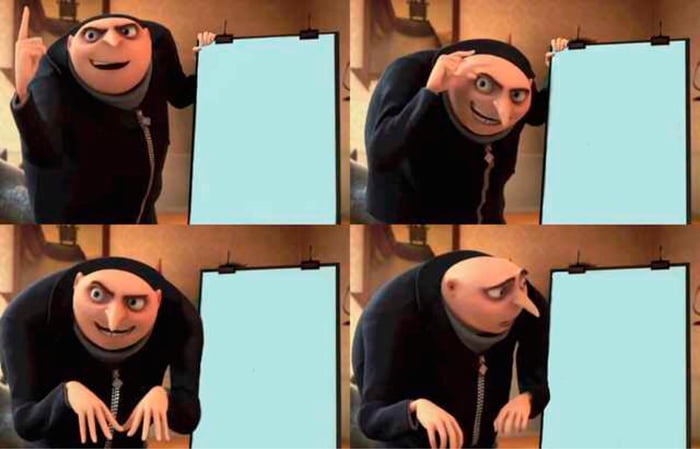

<!--
  check: slides 45-70

  Диапазон меньше лекционного намеренно: из шестидесяти минут воркшопа
  тридцать пять команды работают руками, а не смотрят на слайды.
  Экранов здесь ровно столько, сколько нужно: шаг, что должно получиться,
  что делать, если не получилось, — и доска на время работы.
-->

<!-- @ 0.1 титул -->
<!-- _class: title -->
<!-- _paginate: false -->

# Ставим агента руками

### Часть 3 из 3 · воркшоп, 60 минут

Кирилл Овчинников

<!--
Энергия здесь важнее содержания. Говорить быстрее, чем в первых двух частях.
Хронометраж: 20
-->

---

<!-- @ 0.2 что получится -->

## Что у вас будет через час

<div class="grid-3">
  <div class="card"><b>Свой агент</b>Работает на вашем ноутбуке, отвечает вам</div>
  <div class="card"><b>Свой скилл</b>Текстовый файл с правилами вашей задачи</div>
  <div class="card"><b>Опыт провала</b>Вы увидите, где он ломается — это ценнее успеха</div>
</div>

<div class="callout warn">

Не у всех всё заработает с первого раза. Это нормально и заложено в план.

</div>

<!--
Снять напряжение сразу: обещать не гладкость, а результат. Иначе первая же ошибка убьёт настрой.
Хронометраж: 35
-->

---

<!-- @ 0.3 команды -->

## Делимся на команды по трое

<div class="grid-3">
  <div class="card"><b>Водитель</b>Единственный, кто трогает клавиатуру. Ноутбук — его</div>
  <div class="card"><b>Штурман</b>Читает инструкцию вслух по одному шагу. Не даёт торопиться</div>
  <div class="card"><b>Секретарь</b>Записывает: что получилось, что сломалось, что спросить</div>
</div>

<div class="callout">

Роли не формальность. Без штурмана водитель проскакивает шаги, без секретаря нечего обсуждать в конце.

</div>

<!--
Настоять на ролях. Если команда откажется — она отстанет, и это будет заметно.
Хронометраж: 50
-->

---

<!-- @ 0.4 правила -->

## Четыре правила воркшопа

<div class="grid-4">
  <div class="card"><b>Рука вверх</b>Застряли больше чем на 3 минуты — поднимаете руку. Не героизм</div>
  <div class="card"><b>Не забегайте</b>Один шаг за раз. Забежали вперёд — потеряли команду</div>
  <div class="card"><b>Ничего секретного</b>Только выдуманные или обезличенные данные</div>
  <div class="card"><b>Сломать нельзя</b>Всё происходит у вас на ноутбуке. Худшее — переустановить</div>
</div>

<!--
Третье правило проговорить отдельно и всерьёз: это первое, о чём спросит служба безопасности.
Хронометраж: 50
-->

---

<!-- @ 0.4a мем: this is fine -->

## Настрой на ближайший час

<div class="meme" style="--h:340px">
  
</div>

<p class="muted center">И здесь это правда fine: всё происходит в песочнице на вашем ноутбуке. Худшее из возможного — переустановить заново.</p>

<!--
Снять страх «нажму не то и сломаю» — главный тормоз таких залов. Огонь на картинке — это макет, а не прод.
Хронометраж: 15
-->

---

<!-- @ 0.5 два пути -->

## Два пути установки

<div class="compare">
  <div class="card good">

#### Путь A · Hermes (по умолчанию)

Обычный установщик с кнопкой «Далее». Графическое приложение. Терминал почти не нужен.

  </div>
  <div class="card">

#### Путь B · OpenClaw

Ставится командой в терминале. Умеет Telegram — с агентом можно говорить с телефона.

  </div>
</div>

<div class="callout">

По умолчанию все идут путём A. Путь B — для одной команды, которая сядет рядом с техническим помощником.

</div>

<!--
Назначить команду B заранее, по итогам pre-flight. Не спрашивать зал добровольцев — потеряете пять минут.
Хронометраж: 50
-->

---

<!-- @ 0.6 план часа -->

## План часа

<div class="flow">
  <div class="box hi"><b>15 мин</b><small>установка</small></div>
  <div class="arrow"></div>
  <div class="box"><b>10 мин</b><small>первый запуск</small></div>
  <div class="arrow"></div>
  <div class="box"><b>15 мин</b><small>скиллы</small></div>
  <div class="arrow"></div>
  <div class="box"><b>10 мин</b><small>боевая задача</small></div>
  <div class="arrow"></div>
  <div class="box"><b>10 мин</b><small>разбор</small></div>
</div>

<div class="callout warn">

Таймер на экране идёт всегда. Когда время блока вышло — идём дальше, даже если не у всех получилось.

</div>

<!--
Жёсткий тайминг — единственный способ довести воркшоп до конца. Предупредить об этом сейчас, чтобы потом не спорить.
Хронометраж: 40
-->

---

<!-- @ 1.0 разделитель установка -->
<!-- _class: section -->
<!-- _transition: cover -->

#### Блок 1 · 15 минут

# Установка

Раздатка у вас на столе. Штурман читает вслух, водитель делает.

<!--
Раздать распечатки сейчас, если ещё не лежат на столах.
Хронометраж: 20
-->

---

<!-- @ 1.1 шаг 1 -->
<!-- _class: step -->

#### Шаг 1 из 6 · путь A

# Проверьте, что установлен Git

<div class="timer">15:00</div>

<div class="callout">

Единственное, что Hermes не ставит за вас. Проверка есть в раздатке — один пункт.

</div>

<div class="callout warn">

#### Если Git не установлен

Ссылка на установщик — в раздатке. Это плюс две минуты, не паникуйте.

</div>

<!--
Это самая частая причина сорванной установки. Лучше потратить минуту здесь, чем десять потом.
Хронометраж: 70
-->

---

<!-- @ 1.1a что должно быть на экране -->
<!-- _class: step -->

#### Шаг 1 · что должно быть на экране

# Git на месте

<div class="callout good">

Команда проверки вернула номер версии — что-то вроде `git version 2.43.0`. Номер не важен, важно, что он есть.

</div>

<div class="callout bad">

#### Что означает ошибка

`command not found` или «не является внутренней командой» — Git не установлен. Ссылка на установщик в раздатке, шаг займёт две минуты.

</div>

<!--
Место для скриншота обоих исходов. Снять на репетиции установки.
Хронометраж: 45
-->

---

<!-- @ 1.2 шаг 2 -->
<!-- _class: step -->

#### Шаг 2 из 6 · путь A

# Скачайте установщик

<div class="timer">13:30</div>

<div class="callout good">

#### Адрес

`hermes-agent.nousresearch.com`

Кнопка Download на главной. Сайт сам определит вашу систему — macOS или Windows.

</div>

<div class="callout warn">

Если Wi-Fi еле дышит — поднимите руку. У помощника есть флешки с установщиком.

</div>

<!--
Скорее всего, именно здесь сеть станет узким местом. Флешки должны лежать на видном месте.
Хронометраж: 90
-->

---

<!-- @ 1.3 шаг 3 -->
<!-- _class: step -->

#### Шаг 3 из 6 · путь A

# Запустите установщик и нажимайте «Далее»

<div class="timer">11:00</div>

<div class="callout">

Установщик сам поставит всё, что нужно: Python, Node.js, поисковый движок, обработку медиа.
Вам не надо знать, что это. Просто дайте ему закончить.

</div>

<div class="callout warn">

#### Займёт 3–7 минут

Полоска может замирать. Это нормально. Не закрывайте окно.

</div>

<!--
Пока идёт установка — обойти столы. Это лучшее время, чтобы поймать отстающих.
Хронометраж: 200
-->

---

<!-- @ 1.3a мем: скелет -->

## Пока крутится полоска

<div class="meme">
  
  <span class="cap top xsmall">Полоска замерла на 99%</span>
  <span class="cap bottom xsmall">Она не зависла. Она думает</span>
</div>

<!--
Слайд-фон на время установки. Пока все ждут — обойти столы.
Хронометраж: 10
-->

---

<!-- @ 1.4 шаг 4 -->
<!-- _class: step -->

#### Шаг 4 из 6 · путь A

# Если система ругается на безопасность

<div class="timer">7:00</div>

<div class="compare">
  <div class="card">

#### macOS

«Не удалось проверить разработчика» → Системные настройки → Конфиденциальность → «Всё равно открыть»

  </div>
  <div class="card">

#### Windows

Синее окно SmartScreen → «Подробнее» → «Выполнить в любом случае»

  </div>
</div>

<!--
Этот слайд обязателен: без него половина зала решит, что установщик — вирус, и остановится.
Хронометраж: 60
-->

---

<!-- @ 1.4a мем: паник-калм -->

## Штатная последовательность эмоций

<div class="meme" style="--h:500px">
  
  <span class="cap free dark xsmall" style="left:3%; top:11%; width:42%">Синее окно на весь экран</span>
  <span class="cap free dark xsmall" style="left:3%; top:44%; width:42%">В раздатке написано, куда нажать</span>
  <span class="cap free dark xsmall" style="left:3%; top:77%; width:42%">Теперь ругается антивирус</span>
</div>

<!--
Нормализовать панику заранее: предупреждений будет два-три, все описаны в раздатке.
Хронометраж: 10
-->

---

<!-- @ 1.5 шаг 5 -->
<!-- _class: step -->

#### Шаг 5 из 6 · путь A

# Откройте приложение Hermes

<div class="timer">6:00</div>

<div class="callout good">

#### Как понять, что получилось

Открылось окно приложения и предлагает настроить агента. Всё, установка позади.

</div>

<div class="callout">

Секретарь: отметьте в блокноте время, когда у вас это получилось. В конце сравним.

</div>

<!--
Попросить команды, у которых получилось, поднять руку — так видно общую готовность зала.
Хронометраж: 70
-->

---

<!-- @ 1.5a если не открывается -->
<!-- _class: step -->

#### Шаг 5 · если не открывается

# Три причины из четырёх

<div class="grid-3">
  <div class="card"><b>Установка не дошла до конца</b>Окно закрыли раньше времени. Запустить установщик заново</div>
  <div class="card"><b>Заблокировала система</b>Вернуться на предыдущий шаг про безопасность</div>
  <div class="card"><b>Нет прав администратора</b>Это не чинится на месте. Поднимите руку — переходим на общий ноутбук</div>
</div>

<div class="callout warn">

Четвёртая причина — что-то новое. Именно для неё здесь помощник.

</div>

<!--
Третий пункт — самый частый в корпоративной среде и единственный, который нельзя решить за минуту.
Не тратить на него время: сразу объединять команду с соседней.
Хронометраж: 60
-->

---

<!-- @ 1.5b мем: it crowd -->

## Совет, который старше всех нас

<div class="meme" style="--h:400px">
  
</div>

<p class="muted center">«Вы пробовали выключить и включить?» — в нашем случае: закрыть всё и запустить установщик заново. Помогает в двух случаях из трёх.</p>

<!--
Показывать с иронией, но совет реальный: повторный запуск установщика чинит недокачанные файлы.
Хронометраж: 10
-->

---

<!-- @ 1.6 шаг 6 путь B -->
<!-- _class: step -->

#### Шаг 6 из 6 · путь B

# Команда на OpenClaw — одна строка

<div class="timer">4:00</div>

```
npm install -g openclaw && openclaw init
```

<div class="callout warn">

Нужен Node.js версии 22.22.3 или новее. Проверка версии — первый пункт вашей раздатки.
Помощник рядом.

</div>

<!--
Показать этот слайд коротко — он для одной команды. Остальным сказать, что можно не переписывать.
Хронометраж: 60
-->

---

<!-- @ 1.6a путь B почему версия -->
<!-- _class: step -->

#### Путь B · почему я придираюсь к версии

# «У меня Node 22» — недостаточно

<div class="compare">
  <div class="card bad">

#### 22.22.2

Установка пройдёт, агент не запустится. Ошибка будет невнятной

  </div>
  <div class="card good">

#### 22.22.3 и выше

Работает

  </div>
</div>

<div class="callout">

Разница в одну цифру в третьем разряде. Это хорошая иллюстрация к тому, почему путь A — по умолчанию: там про версии думает установщик.

</div>

<!--
Слайд для всего зала, не только для команды B: он объясняет, почему установщик с кнопкой «Далее» — не признак несерьёзности.
Хронометраж: 45
-->

---

<!-- @ 1.6b мем: медаль -->

## Медаль каждому, кто скажет это сегодня

<div class="meme" style="--h:420px">
  
</div>

<p class="muted center">«У меня же работает» — не аргумент, а повод сверить версии: у вас 22.22.3, у соседа 22.22.2.</p>

<!--
Классика поддержки. Заодно закрепляет мораль пути A: пусть о версиях думает установщик.
Хронометраж: 10
-->

---

<!-- @ 1.7 контрольная точка -->
<!-- _class: bigtype -->

# Контрольная точка

у кого приложение открылось — поднимите руку

<!--
Если рук меньше половины — не идти дальше, дать ещё три минуты и бросить помощника на отстающих.
Если меньше трети — переходить на план Б, уровень 1: объединять команды вокруг рабочих ноутбуков.
Хронометраж: 50
-->

---

<!-- @ 2.0 разделитель первый запуск -->
<!-- _class: section -->
<!-- _transition: cover -->

#### Блок 2 · 10 минут

# Первый запуск

Ключ, модель, инструменты — и проверка, что агент жив.

<!--
Хронометраж: 15
-->

---

<!-- @ 2.1 ключ -->
<!-- _class: step -->

#### Шаг 1 из 4

# Вставьте ключ команды

<div class="timer">10:00</div>

<div class="callout">

На столе лежит карточка с ключом вашей команды. Это длинная строка символов.
Скопируйте её в поле «API key» в настройках модели.

</div>

<div class="callout bad">

#### Ключ — это доступ к деньгам

Не пересылайте его, не фотографируйте, не выкладывайте. После воркшопа карточки собираем.

</div>

<!--
Проговорить последний пункт всерьёз: это ровно та привычка, которую они должны унести в работу.
Хронометраж: 70
-->

---

<!-- @ 2.2 модель -->
<!-- _class: step -->

#### Шаг 2 из 4

# Выберите модель

<div class="timer">8:30</div>

<div class="callout good">

Какую именно — написано на вашей карточке рядом с ключом. Просто выберите её из списка.

</div>

<div class="callout">

#### Почему я выбрал за вас

Чтобы у всех команд был одинаковый результат и мы могли честно сравнить его в конце.

</div>

<!--
Не пускаться в объяснения про разные модели. Это съест пять минут и никому сейчас не поможет.
Хронометраж: 60
-->

---

<!-- @ 2.3 инструменты -->
<!-- _class: step -->

#### Шаг 3 из 4

# Включите инструменты

<div class="timer">7:30</div>

<div class="grid-3">
  <div class="card"><b>Файлы</b>читать и записывать в рабочей папке</div>
  <div class="card"><b>Поиск</b>в интернете</div>
  <div class="card"><b>Запуск кода</b>чтобы считать, а не угадывать</div>
</div>

<div class="callout warn">

Помните лесенку разрешений из второго часа? Мы сейчас на второй ступеньке: читать и писать себе.

</div>

<!--
Прямая отсылка ко второму часу. Она делает воркшоп продолжением лекции, а не отдельным упражнением.
Хронометраж: 70
-->

---

<!-- @ 2.4 проверка -->
<!-- _class: step -->

#### Шаг 4 из 4

# Проверьте, что агент жив

<div class="timer">6:00</div>

<div class="callout good">

#### Напишите ему дословно

*Привет. Перечисли, какие инструменты тебе сейчас доступны, и посчитай 847 × 293.*

</div>

<div class="callout">

Правильный ответ — 248 171. Если сходится, значит, он не угадал, а посчитал: инструменты работают.

</div>

<!--
Это проверка сразу двух вещей: связь с моделью и работа инструментов.
Если число не сошлось — инструмент запуска кода не включён, вернуться на шаг назад.
Хронометраж: 100
-->

---

<!-- @ 2.4a если число не сошлось -->
<!-- _class: step -->

#### Шаг 4 · если число не сошлось

# Значит, он угадал, а не посчитал

<div class="callout bad">

#### Что произошло

Инструмент запуска кода не включён. Модель попыталась «вспомнить» результат умножения — и ошиблась.

</div>

<div class="callout good">

#### Что делать

Вернуться на шаг с инструментами, включить запуск кода, спросить ещё раз.

</div>

<!--
Это лучшая иллюстрация всего второго часа, случившаяся у них на глазах.
Если в зале есть хоть одна такая команда — обязательно показать её экран всем.
Хронометраж: 60
-->

---

<!-- @ 2.4b мем: math lady -->

## Умножение «по памяти» выглядит так

<div class="meme" style="--h:420px">
  
  <span class="cap bottom small">847 × 293 = ну примерно 250 тысяч</span>
</div>

<!--
Показывать только если у какой-то команды число не сошлось — тогда это идеальная разрядка. Если сошлось у всех, пролистнуть.
Хронометраж: 10
-->

---

<!-- @ 2.5 что вы только что видели -->

## Что вы только что видели

<div class="flow">
  <div class="box"><b>Ваш вопрос</b></div>
  <div class="arrow"></div>
  <div class="box"><b>Агент решил</b><small>«тут нужен расчёт»</small></div>
  <div class="arrow"></div>
  <div class="box"><b>Вызвал инструмент</b></div>
  <div class="arrow"></div>
  <div class="box hi"><b>Ответил числом</b></div>
</div>

<p class="muted">Тот самый цикл со слайда из второго часа — только теперь он произошёл у вас на ноутбуке.</p>

<!--
Короткий, но важный слайд: связать абстрактную схему с тем, что они только что сделали руками.
Хронометраж: 45
-->

---

<!-- @ 2.6 контрольная точка -->
<!-- _class: bigtype -->

# 248 171

у кого сошлось — поднимите руку

<!--
Если у кого-то не сошлось — это почти всегда выключенный инструмент запуска кода. Помощник проходит по рукам.
Хронометраж: 50
-->

---

<!-- @ 3.0 разделитель скиллы -->
<!-- _class: section -->
<!-- _transition: cover -->

#### Блок 3 · 15 минут

# Скиллы

Самая важная часть воркшопа. Здесь агент превращается в вашего сотрудника.

<!--
Сказать вслух, что это главный блок. Дальше внимание начнёт падать, надо его собрать.
Хронометраж: 20
-->

---

<!-- @ 3.1 что такое скилл -->
<!-- _class: bigtype -->

# Скилл — это текстовый файл

вы его пишете обычными словами, как инструкцию новому сотруднику

<!--
Повтор ключевого слайда из второго часа. Повторить намеренно — сейчас они это сделают руками.
Хронометраж: 30
-->

---

<!-- @ 3.2 зачем скилл -->

## Зачем он нужен

<div class="compare">
  <div class="card bad">

#### Без скилла

Каждый раз объясняете заново. Забыли деталь — получили не то. В новом чате всё сначала.

  </div>
  <div class="card good">

#### Со скиллом

Правила записаны один раз. Агент подхватывает их сам, когда узнаёт задачу.

  </div>
</div>

<p class="muted">Помните про конечную память из второго часа? Скилл — это то, что в неё не помещается и потому вынесено в файл.</p>

<!--
Связка с контекстным окном обязательна: без неё скилл выглядит просто как «шаблон промпта».
Хронометраж: 40
-->

---

<!-- @ 3.3 анатомия скилла -->
<!-- _class: dense -->

## Из чего состоит скилл

| Раздел | Что писать | Пример |
|---|---|---|
| Название | Коротко, без пробелов | `smena-svodka` |
| Когда применять | По этой строке агент решает, брать скилл или нет | «когда просят свести отчёты смены» |
| Что на входе | Какие данные нужны | «текст отчётов за сутки» |
| Что делать | Шаги по порядку | «сгруппировать по времени, выделить открытые» |
| Формат ответа | Жёстко, иначе каждый раз по-разному | «четыре раздела, не длиннее страницы» |
| Чего не делать | Самый важный раздел | «не придумывать числа» |

<!--
Обратить внимание на последнюю строку. Раздел «чего не делать» люди пропускают, а он ловит львиную долю проблем.
Хронометраж: 60
-->

---

<!-- @ 3.3a три готовых скилла -->

## В раздатке — три готовых скилла

<div class="grid-3">
  <div class="card"><b>Сводка по смене</b>Три отчёта на входе — одна страница на выходе. Разбираем вместе</div>
  <div class="card"><b>Триаж инцидента</b>Категория, приоритет по матрице, кого звать, первые три действия</div>
  <div class="card"><b>Дайджест по KPI</b>Что выросло, что упало, что пробило порог, один вопрос на планёрку</div>
</div>

<div class="callout">

Все три — обычный текст на русском. Ни строчки кода. Откройте любой и убедитесь.

</div>

<!--
Показать физически: поднять распечатку и полистать. Зал должен увидеть, что это одна страница текста.
Хронометраж: 45
-->

---

<!-- @ 3.3b самая важная строка -->

## Строка, ради которой всё затевалось

<div class="callout bad">

#### Без неё

*«Среднее время реакции за смену — 12 минут»* — числа в исходных данных не было.

</div>

<div class="callout good">

#### С ней

*«Среднее время реакции: нет данных»*

</div>

<div class="callout">

А сама строка выглядит так: **«Не выводи ни одного числа, которого нет во входных данных. Если данных нет — пиши „нет данных“.»**

</div>

<!--
Это самый практичный слайд воркшопа. Попросить всех вписать эту строку в свой скилл прямо сейчас.
Хронометраж: 50
-->

---

<!-- @ 3.3c мем: анкормен -->

## Сводка без этой строки

<div class="meme" style="--h:410px">
  
</div>

<p class="muted center">«Исследования проводились: в 60% случаев работает всегда». Так звучит отчёт, которому разрешили выдумывать числа.</p>

<!--
Абсурдная статистика Брайана Фантаны — ровно то, что производит агент без запрета «нет данных — пиши „нет данных“».
Хронометраж: 10
-->

---

<!-- @ 3.4 шаг разбираем готовый -->
<!-- _class: step -->

#### Шаг 1 из 3

# Откройте готовый скилл и прочитайте

<div class="timer">15:00</div>

<div class="callout good">

Файл `smena-svodka` — сводка по отчётам смены. Он у вас в раздатке целиком, на одну страницу.
Прочитайте вслух втроём.

</div>

<div class="callout">

Задача штурмана: найти в нём хотя бы одно правило, которое **не подходит** вашему подразделению.

</div>

<!--
Последнее задание превращает чтение из пассивного в активное. Обычно находят сразу.
Хронометраж: 120
-->

---

<!-- @ 3.5 шаг подключаем -->
<!-- _class: step -->

#### Шаг 2 из 3

# Подключите его к своему агенту

<div class="timer">12:00</div>

<div class="callout">

Скопируйте файл в папку скиллов — путь указан в раздатке. Или перетащите его в окно приложения.

</div>

<div class="callout good">

#### Проверка

Напишите агенту: *«Какие скиллы у тебя есть?»* — он должен назвать новый.

</div>

<!--
Если скилл не подхватился — почти всегда файл лёг не в ту папку или назван не SKILL.md.
Хронометраж: 110
-->

---

<!-- @ 3.6 шаг пишем свой -->
<!-- _class: step -->

#### Шаг 3 из 3

# Перепишите его под себя

<div class="timer">9:00</div>

<div class="callout warn">

#### Не пишите с нуля

Возьмите готовый файл и меняйте: свои разделы, свои нормативы, свой формат, свои запреты.

</div>

<div class="callout good">

Секретарь диктует, что у вас на самом деле должно быть в сводке. Водитель печатает. Штурман следит, чтобы дошли до раздела «чего не делать».

</div>

<!--
Это ядро воркшопа. Ходить между столами и подталкивать: «а что у вас реально спрашивают на утренней планёрке?»
Хронометраж: 60
-->

---

<!-- @ 3.6a доска пока работают -->
<!-- _class: step -->

# Пишем свой скилл

<div class="timer">идёт работа</div>

<div class="grid-3">
  <div class="card"><b>Водитель</b>печатает, не спорит</div>
  <div class="card"><b>Секретарь</b>диктует, как должно быть на самом деле</div>
  <div class="card"><b>Штурман</b>следит, чтобы дошли до «чего не делать»</div>
</div>

<div class="callout good">

Застряли — рука вверх. Не сидите молча: три минуты тишины стоят дороже одного вопроса.

</div>

<!--
Этот слайд висит на экране всё время работы команд. Ведущий в это время ходит по столам.
Хронометраж: 330
-->

---

<!-- @ 3.7 подсказки -->

## Если застряли — три подсказки

<div class="grid-3">
  <div class="card"><b>Пишите как человеку</b>«Если данных нет — так и напиши, не выдумывай». Никакого особого языка не нужно</div>
  <div class="card"><b>Начните с запретов</b>Что вас бесит в чужих отчётах? Это и есть раздел «чего не делать»</div>
  <div class="card"><b>Один формат</b>Опишите разделы отчёта по пунктам. Это снимет половину вариативности</div>
</div>

<!--
Показывать этот слайд молча, фоном, пока команды работают. Он для тех, кто застрял.
Хронометраж: 30
-->

---

<!-- @ 3.8 контрольная точка -->
<!-- _class: bigtype -->

# Три минуты до боевой задачи

дописывайте раздел, который начали

<!--
Предупредить заранее — иначе половина команд не успеет закончить мысль и расстроится.
Хронометраж: 30
-->

---

<!-- @ 4.0 разделитель боевая задача -->
<!-- _class: section -->
<!-- _transition: cover -->

#### Блок 4 · 10 минут

# Боевая задача

Проверяем, работает ли то, что вы написали.

<!--
Хронометраж: 15
-->

---

<!-- @ 4.1 задание -->
<!-- _class: step -->

# Возьмите карточку задания

<div class="timer">10:00</div>

<div class="callout">

На каждом столе — карточка с задачей и выдуманными исходными данными: три отчёта смены,
описание инцидента или выгрузка показателей.

</div>

<div class="callout good">

#### Что сделать

Скормите данные агенту и попросите применить ваш скилл. Секретарь фиксирует: что вышло хорошо, что не так.

</div>

<!--
Настоять на фиксации именно неудач — на разборе они дадут больше пользы, чем успехи.
Хронометраж: 60
-->

---

<!-- @ 4.1a доска пока работают -->
<!-- _class: step -->

# Боевая задача

<div class="timer">идёт работа</div>

<div class="callout">

#### Порядок

Дать агенту данные с карточки → попросить применить ваш скилл → прочитать ответ втроём → записать замечания.

</div>

<div class="callout good">

Успели с первого раза — допишите одно правило и запустите ещё раз. Сравните.

</div>

<!--
Слайд висит на экране во время работы. Второй абзац — для быстрых команд, чтобы не скучали.
Хронометраж: 400
-->

---

<!-- @ 4.2 на что смотреть -->

## На что смотреть в ответе

<div class="grid-4">
  <div class="card"><b>Формат</b>Он соблюдён? Если нет — формат в скилле описан нечётко</div>
  <div class="card"><b>Числа</b>Все ли есть в исходных данных? Или что-то появилось из воздуха?</div>
  <div class="card"><b>Пробелы</b>Написал «нет данных» — или тихо пропустил?</div>
  <div class="card"><b>Полезность</b>Вы бы отправили это руководителю? Честно</div>
</div>

<!--
Четвёртый вопрос — главный. Именно на него отвечают в конце вслух.
Хронометраж: 45
-->

---

<!-- @ 4.3 если плохо -->

## Если получилось плохо — это результат

<div class="callout good">

#### Правильная реакция

Не «агент дурак», а «какого правила не хватало в моём файле».

</div>

<div class="callout">

Допишите одно правило и запустите ещё раз. Обычно одной строки хватает, чтобы ответ стал заметно лучше.

</div>

<!--
Эта мысль — главное, что они должны унести с воркшопа. Проговорить медленно.
Хронометраж: 50
-->

---

<!-- @ 4.3a мем: боб росс -->

## Как это называл Боб Росс

<div class="meme" style="--h:390px">
  
</div>

<p class="muted center">«Мы не ошибаемся — у нас счастливые маленькие случайности». Каждая — готовая строка в раздел «чего не делать».</p>

<!--
Тёплая точка перед разбором: неудачный прогон — это материал, а не провал.
Хронометраж: 10
-->

---

<!-- @ 5.0 разделитель разбор -->
<!-- _class: section -->
<!-- _transition: cover -->

#### Блок 5 · 10 минут

# Разбор

Что получилось, что сломалось и что с этим делать в понедельник.

<!--
Хронометраж: 15
-->

---

<!-- @ 5.1 демо команд -->
<!-- _class: step -->

# По одной минуте от команды

<div class="timer">5:00</div>

<div class="callout">

#### Три вопроса, на которые отвечаете

Какую задачу взяли. Что агент сделал хорошо. На чём он вас подвёл.

</div>

<div class="callout warn">

Строго минута. Секретарь говорит, остальные молчат.

</div>

<!--
Держать таймер жёстко. Пять команд по минуте — это ровно пять минут, иначе разбор съест весь остаток.
Хронометраж: 240
-->

---

<!-- @ 5.2 что обычно ломается -->

## Что обычно ломается — и почему

<div class="grid-4">
  <div class="card"><b>Формат поплыл</b>В скилле описан словами, а не по пунктам</div>
  <div class="card"><b>Придумал число</b>Нет запрета «не выдумывай, пиши „нет данных“»</div>
  <div class="card"><b>Слишком длинно</b>Не задан предел объёма</div>
  <div class="card"><b>Взял не тот скилл</b>Строка «когда применять» слишком расплывчата</div>
</div>

<div class="callout good">

Все четыре чинятся одной строкой в текстовом файле. Ни одна — программированием.

</div>

<!--
Это самый практичный слайд воркшопа. Дать зал сфотографировать.
Хронометраж: 50
-->

---

<!-- @ 5.2a дайте документ -->

## Приём, который сработает завтра

<div class="compare">
  <div class="card bad">

#### Спрашивать по памяти

*«Какой у нас срок эскалации?»* — агент сочинит правдоподобный пункт регламента

  </div>
  <div class="card good">

#### Дать документ

*«Вот регламент. Найди срок эскалации и процитируй пункт»* — агент прочитает и ответит

  </div>
</div>

<p class="muted">Тот самый приём из второго часа. Работает в любом агенте, любом чате и без всякой настройки.</p>

<!--
Самый переносимый навык дня: он не требует ни установки, ни скиллов, ни разрешений.
Хронометраж: 40
-->

---

<!-- @ 5.2b кому это отдавать -->

## Кому в подразделении это отдавать

<div class="grid-3">
  <div class="card"><b>Не самому загруженному</b>Он не найдёт времени дописывать правила, и всё заглохнет</div>
  <div class="card"><b>Не самому техничному</b>Он уйдёт в настройки вместо задачи</div>
  <div class="card"><b>Тому, кого бесит рутина</b>У него есть мотивация довести скилл до ума</div>
</div>

<div class="callout good">

Скилл пишет тот, кто знает задачу. Техническая часть здесь — двадцать минут, содержательная — месяц.

</div>

<!--
Прямой управленческий совет. Обычно вызывает узнавание: все трое типажей в зале известны.
Хронометраж: 45
-->

---

<!-- @ 5.3 чек-лист безопасности -->

## Прежде чем нести это в работу

<div class="grid-4">
  <div class="card"><b>Персональные данные</b>Не отдавать без согласования с безопасностью</div>
  <div class="card"><b>Ключи и пароли</b>Никогда не вставлять в переписку с агентом</div>
  <div class="card"><b>Наружу — через человека</b>Ни одно письмо клиенту не уходит без вычитки</div>
  <div class="card"><b>Чужой текст — не приказ</b>Помните про письмо с «игнорируй инструкции»</div>
</div>

<div class="callout bad">

Этот чек-лист лежит у вас в раздатке. Он должен появиться в регламенте раньше, чем агент — на рабочих местах.

</div>

<!--
Последний пункт — прямое поручение. Назвать срок и ответственного, если это уместно.
Хронометраж: 50
-->

---

<!-- @ 5.4 с чего начать в понедельник -->

## С чего начать в понедельник

<div class="flow vertical">
  <div class="box"><b>Найдите задачу с проверяемым результатом</b><small>вы должны уметь оценить ответ за минуту</small></div>
  <div class="arrow"></div>
  <div class="box"><b>Напишите скилл и месяц пользуйтесь сами</b><small>дописывая по строчке после каждого промаха</small></div>
  <div class="arrow"></div>
  <div class="box hi"><b>Только потом отдавайте команде</b><small>вместе с чек-листом безопасности</small></div>
</div>

<!--
Средний шаг важнее всего: месяц личного использования — единственный способ дописать все правила, которых не хватает.
Хронометраж: 50
-->

---

<!-- @ 5.5 что не делать -->

## Чего точно не делать

<div class="compare">
  <div class="card bad">

#### Плохой первый проект

Автоматизировать сразу весь процесс. Отдать агенту доступ ко всем системам. Убрать человека из цепочки.

  </div>
  <div class="card good">

#### Хороший первый проект

Одна задача. Один скилл. Результат читает человек. Через месяц — честный разбор.

  </div>
</div>

<!--
Типичная ошибка руководителя после такого воркшопа — взяться за самое большое. Предупредить прямо.
Хронометраж: 40
-->

---

<!-- @ 5.5a мем: план гру -->

## План, который мы только что отменили

<div class="meme" style="--h:450px">
  
  <span class="cap free dark xsmall" style="left:28%; top:9%;  width:20%">Автоматизировать всё разом</span>
  <span class="cap free dark xsmall" style="left:78%; top:9%;  width:20%">Дать агенту все доступы</span>
  <span class="cap free dark xsmall" style="left:28%; top:59%; width:20%">Агент молча удалил лишнее</span>
  <span class="cap free dark xsmall" style="left:78%; top:59%; width:20%">Агент молча удалил лишнее</span>
</div>

<!--
Четвёртая панель повторяет третью — в этом вся шутка. Дать зачитать самим.
Хронометраж: 15
-->

---

<!-- @ 5.6 итог трёх часов -->

## Три часа в трёх фразах

<div class="callout">

#### Час первый

Модель не понимает текст — она предсказывает следующий кусочек.

</div>

<div class="callout">

#### Час второй

Разговаривать её научили люди. Уверенный тон ничего не гарантирует.

</div>

<div class="callout good">

#### Час третий

Управлять ею можно текстовым файлом с правилами. Который вы теперь умеете писать.

</div>

<!--
Финальный слайд по смыслу. Дальше только организационное.
Хронометраж: 50
-->

---

<!-- @ 5.7 что забрать -->

## Что забрать с собой

<div class="grid-4">
  <div class="card"><b>Раздатки</b>Инструкции по установке и шаблон скилла</div>
  <div class="card"><b>Свой скилл</b>Файл остался у вас на ноутбуке</div>
  <div class="card"><b>Чек-лист</b>Безопасность — на холодильник</div>
  <div class="card"><b>Карточку с ключом</b>Сдать мне. Она общая и временная</div>
</div>

<div class="callout warn">

Ключи собираем сейчас. У кого агент останется — напишите мне, дам личный.

</div>

<!--
Не забыть физически собрать карточки. Это вопрос дисциплины, за которым будут наблюдать.
Хронометраж: 35
-->

---

<!-- @ 5.8 финал -->
<!-- _class: bigtype dark -->

# Спасибо

вопросы — сейчас, потом и в любое время

<!--
Оставить слайд на экране на время неформальных вопросов.
Хронометраж: 30
-->
