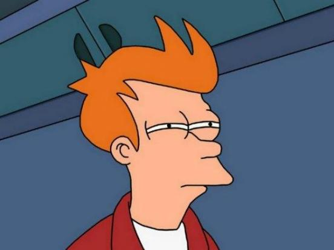

# Шпаргалка по теме `corporate`

Холст 1280×720. Базовый текст 28px, минимальная подпись 20px — слайд должен читаться с восьми метров.

## Классы слайдов

Ставятся директивой в начале слайда: `<!-- _class: lead -->`

| Класс | Для чего |
|---|---|
| `title` | Титул части. Тёмный фон. `# Заголовок`, `### подзаголовок`, `параграф` |
| `section` | Разделитель блока. Тёмный фон. `#### Блок N`, `# Название`, параграф |
| `lead` | Один крупный тезис, вертикально по центру |
| `bigtype` | Табло: гигантское число или слово по центру |
| `quote` | Цитата в кавычках-ёлочках + мелкий источник последним параграфом |
| `step` | Шаг воркшопа: `#### Шаг N из M`, `# Действие`, плюс `<div class="timer">10 мин</div>` |
| `dense` | Разрешает мелкий кегль там, где без таблицы никак |
| `dark` | Тёмный модификатор, композируется: `_class: dark lead` |
| `debug-overflow` | Обводит все элементы — для поиска переполнения |

На обычных слайдах заголовок прибит к верху, а тело центрируется в остатке автоматически.
Классы со своей раскладкой (`title`, `section`, `lead`, `bigtype`, `quote`, `step`) из этого исключены.

## Компоненты

Обычные `<div>` внутри слайда. `html: true` включён в `marp.config.mjs`.

### `.flow` — конвейер со стрелками

```html
<div class="flow">
  <div class="box"><b>Текст</b><small>пояснение</small></div>
  <div class="arrow" data-label="что происходит"></div>
  <div class="box hi"><b>Модель</b></div>
</div>
```

`.hi` — акцентный блок. `.flow.vertical` — вертикальный вариант. `data-label` необязателен.

### `.bars` — полосы с числами (заменяет 90% графиков)

```html
<div class="bars">
  <div class="bar"><div class="label">GPT-3</div><div class="track"><div class="fill" style="--v:18"></div></div><div class="value">175 млрд</div></div>
</div>
```

`--v` — процент заполнения (0–100). Модификаторы строки: `.alt` (второй цвет), `.dim` (серый).

### `.scale` — фигуры радикально разного размера

```html
<div class="scale">
  <div class="item"><div class="dot" style="--s:18"></div><div class="cap"><b>1 млн</b><small>подпись</small></div></div>
</div>
```

`--s` — диаметр в пикселях. Держите максимум ≤ 220, иначе слайд переполнится.

### `.chips` — фраза, разрезанная на токены

```html
<div class="chips">
  <span class="t freq">Опер</span><span class="t rare">ацион</span>
</div>
```

`.freq` — частый кусок (синий), `.rare` — редкий (жёлтый), без класса — нейтральный.
`.chips.small` — мелкий вариант. Пробелы внутри `<span>` сохраняются (`white-space: pre`).

### `.compare` — две карточки

```html
<div class="compare">
  <div class="card good">

#### Можно

- пункт

  </div>
  <div class="card bad">…</div>
</div>
```

Внутри карточки markdown работает, если оставить **пустые строки** вокруг содержимого.

### `.timeline`, `.stack`, `.grid-2/3/4`, `.kv`, `.callout`, `.cols`

```html
<div class="timeline">
  <div class="pt dim"><b>1950-е</b><small>подпись</small></div>
  <div class="pt"><b>2017</b><small>трансформер</small></div>
</div>

<div class="stack">
  <div class="layer hi"><b>Агент</b><span>справа приглушённо</span></div>
</div>

<div class="grid-3">
  <div class="card"><b>Заголовок</b>Текст плитки</div>
</div>

<div class="kv">
  <div class="item"><b>0,75</b><span>слова в токене</span></div>
</div>

<div class="callout warn">

#### Осторожно

Текст выноски.

</div>

<div class="cols">
<div>левая колонка</div>
<div>правая колонка</div>
</div>
```

`.callout` — модификаторы `warn` / `bad` / `good`. `.cols-1-2` и `.cols-2-1` — несимметричные колонки.
`.pt.dim` — приглушённая точка таймлайна.

### `.meme` — картинка-мем с накладными подписями

```html
<div class="meme" style="--h:460px">
  
  <span class="cap top">Не пойму: модель тупая</span>
  <span class="cap bottom">или я плохо объясняю</span>
</div>
```

`.cap.top` / `.cap.bottom` — классические верх/низ. `.cap.dark` — тёмный текст без обводки
для белых областей шаблона (Дрейк, «две кнопки»). `.cap.free` + inline `left/top/width`
в процентах — подпись в конкретной панели многопанельного шаблона. `.cap.small` /
`.cap.xsmall` — мельче. `--h` — максимальная высота картинки (по умолчанию 480px).

### `.imgframe` — фото или скриншот с рамкой

```html
<figure class="imgframe" style="--h:440px">
  
  <figcaption>Подпись и источник мелким шрифтом</figcaption>
</figure>
```

## Инлайновый SVG

Для настоящей геометрии (карта смыслов, внимание, деревья генерации). Правила:

- только `viewBox`, без пиксельных `width`/`height` — размер задаёт CSS;
- шрифт не указывать, он наследуется из темы (`svg text { font-family: var(--font-sans) }`);
- цвета через `currentColor` или переменные темы (`var(--accent)`);
- **никаких** `<foreignObject>` и внешних `href` — сети у Chromium при экспорте нет;
- минимальный кегль подписи — 20 единиц viewBox при типичной ширине 1000.

## Заметки докладчика

```markdown
<!-- @ 3.4 токены: разбор фразы -->
## Заголовок слайда

<!--
Главная мысль одной строкой.
Пример, который рассказываем.
Хронометраж: 90
-->
```

Комментарий, начинающийся с `@`, — навигационный якорь (в заметки не попадает).
`Хронометраж: N` в секундах собирается в сводку `make notes`.

## Брендинг

Все цвета — в блоке `:root` в начале `corporate.css`. Под брендбук достаточно поменять
`--accent`, `--accent-2`, `--ink` и `--dark-bg`. Логотип: положить в `assets/brand/`
и вставлять `` на титульных слайдах.

Если брендбук требует конкретной гарнитуры — вшивать её `woff2` в тему как base64 data-URI.
Только это переживает и `marp -w`, и экспорт в PDF. Внешние ссылки на шрифты не работают.
